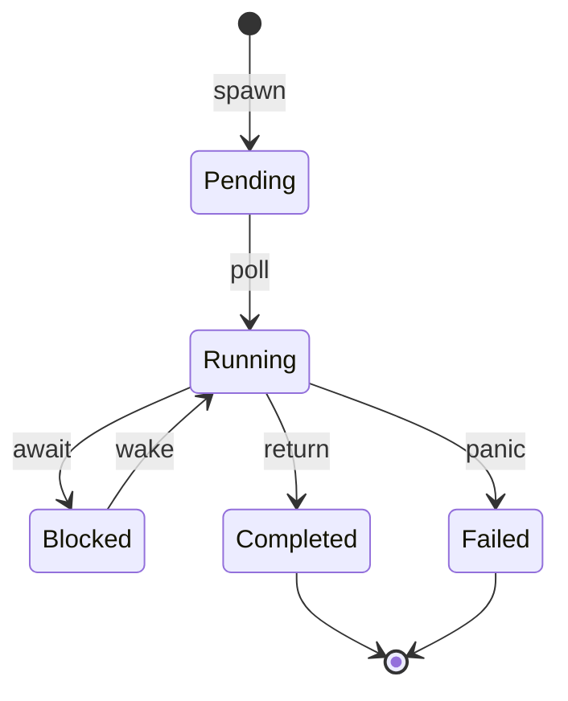
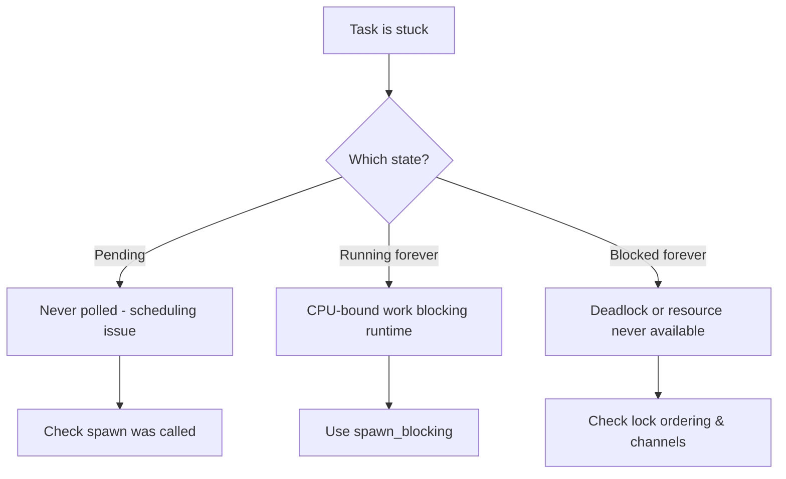
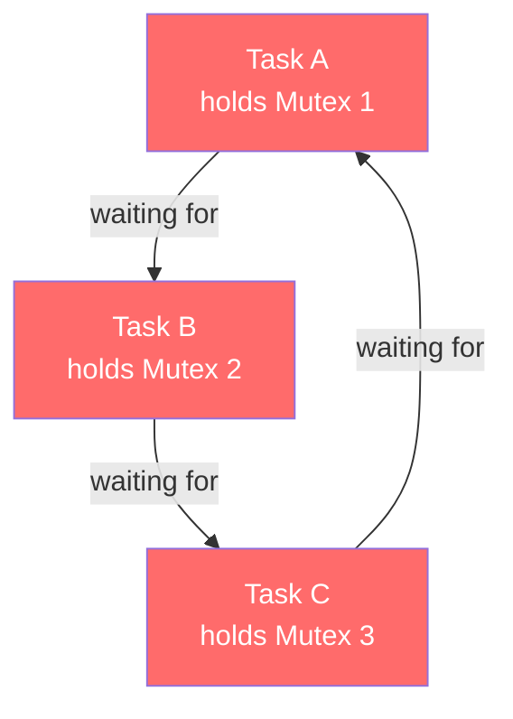
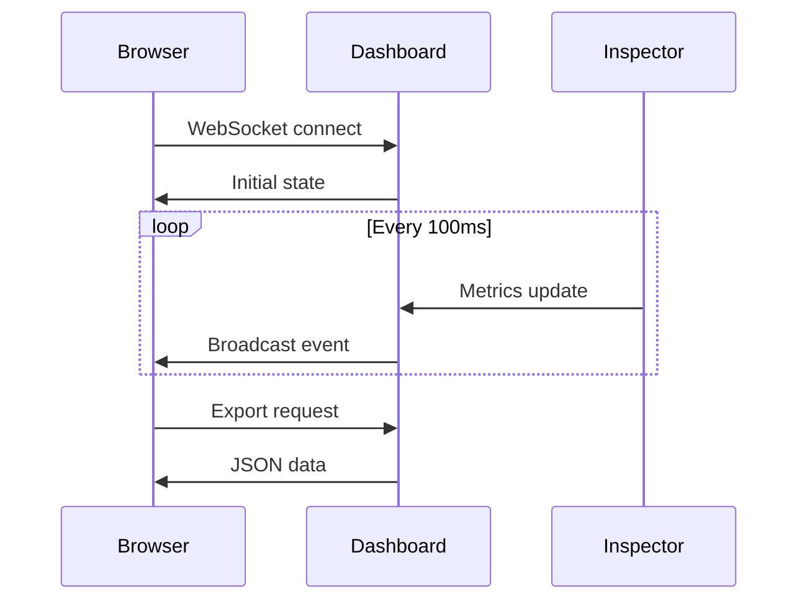
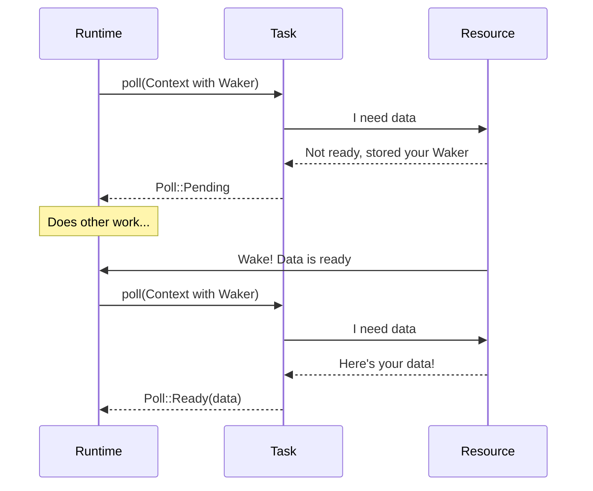

import Lead from "~/components/editorial/Lead.astro";
import PullQuote from "~/components/editorial/PullQuote.astro";
import InfoBox from "~/components/editorial/InfoBox.astro";
import Alert from "~/components/editorial/Alert.astro";
import DiveDeep from "~/components/editorial/DiveDeep.astro";
import StyledList from "~/components/editorial/StyledList.astro";

# Building async-inspect: My Journey Learning Async Rust

<Lead>
I built <a href="https://github.com/ibrahimcesar/async-inspect">async-inspect</a>, a production-ready debugging tool for async Rust, as a learning project. It grew from a simple task tracker to a complete ecosystem with IDE plugins, LSP support, and real-time dashboards. Here's what I learned along the way—and how you can apply these lessons to your own async Rust journey.
</Lead>

## The Beginning: Why I Built This

Like many developers coming to Rust, I was intrigued by async/await but found it surprisingly **opaque**. When you write:

```rust
async fn fetch_data() {
    let data = api_call().await;
    process(data).await;
}
```

**What's actually happening?** Where do tasks go when they're waiting? How do I debug a deadlock? Why is my async program slow?

<PullQuote cite="Every async/await newbie, at some point">
I understood the syntax, but I couldn't visualize what was happening under the hood.
</PullQuote>

The existing tools (tokio-console, tracing) are excellent, but I wanted something different:

<StyledList type="check">
<li><strong>Learn by building</strong>: Understand async internals by instrumenting them</li>
<li><strong>Developer-friendly</strong>: IDE integration, not just CLI tools</li>
<li><strong>Production-ready</strong>: Usable in real projects, not just a learning toy</li>
</StyledList>

So I started building async-inspect.

## Understanding Async: The State Machine Model

The first "aha!" moment came when I realized async Rust is **just state machines**.



Every `.await` point is a **state transition**. To debug async code, you need to track these transitions.

<InfoBox type="tip" title="Key Insight">
An async function is not "running" continuously—it's a state machine that yields control at every <code>.await</code> point. The runtime polls it when resources are ready.
</InfoBox>

### Why This Matters for Debugging

When your async code hangs, one of these things is happening:



**This diagram became the mental model for async-inspect.**

## The Architecture: RAII-Based Tracking

<Alert type="info" title="Design Decision">
I chose RAII (Resource Acquisition Is Initialization) for automatic instrumentation. This means you don't need to remember to clean up tracking—it happens automatically.
</Alert>

```rust
pub struct TaskGuard {
    task_id: TaskId,
    started: Instant,
}

impl Drop for TaskGuard {
    fn drop(&mut self) {
        let duration = self.started.elapsed();
        Inspector::global().record_completion(self.task_id, duration);
    }
}
```

When the future completes **or panics**, the guard's `Drop` runs and records the event. No manual cleanup needed.

## Phase 1: Core Infrastructure

### What I Built

<StyledList type="number" size="lg">
<li><strong>Task Tracking</strong>: Every async task gets a unique ID</li>
<li><strong>Event System</strong>: Timeline of what happened (spawned, polled, blocked, completed)</li>
<li><strong>Inspector Singleton</strong>: Global state accessible from anywhere</li>
<li><strong>Instrumentation Macros</strong>: <code>inspect_task_start!()</code>, <code>inspect_point!()</code></li>
</StyledList>

### What I Learned

<InfoBox type="warning" title="Threading is Hard">
My first implementation used <code>std::sync::RwLock</code> and immediately hit deadlocks. Switched to <code>parking_lot::RwLock</code> which is faster and more predictable.
</InfoBox>

```rust
use parking_lot::RwLock;  // Game changer!
use once_cell::sync::Lazy;

static INSPECTOR: Lazy<Inspector> = Lazy::new(Inspector::new);
```

Why `parking_lot`?
- **Faster** (no poisoning checks)
- **More predictable** (no panic handling complexity)
- **Better for frequent reads** (async monitoring)

## Phase 2: Runtime Integration

### The Challenge

I wanted tracking to be **effortless**. Compare:

```rust
// Manual (bad UX) ❌
let guard = Inspector::track_task("my_task");
tokio::spawn(async move {
    let _guard = guard;
    // ...
});

// Automatic (good UX) ✅
spawn_tracked("my_task", async {
    // Just works!
});
```

### The Solution: Wrapper Types

```rust
pub fn spawn_tracked<F>(name: impl Into<String>, future: F) -> JoinHandle<F::Output>
where
    F: Future + Send + 'static,
    F::Output: Send + 'static,
{
    let task_id = TaskId::new();
    let name = name.into();

    Inspector::global().register_task(task_id, name.clone());

    tokio::spawn(async move {
        let _guard = TaskGuard::new(task_id);
        future.await
    })
}
```

I implemented this for **three runtimes**: Tokio, async-std, and smol.

<DiveDeep title="Extension Traits: A Powerful Pattern">

Extension traits let you add methods to existing types without modifying them:

```rust
pub trait InspectExt: Future + Sized {
    fn inspect(self, label: impl Into<String>) -> TrackedFuture<Self> {
        TrackedFuture::new(self, label.into())
    }
}

impl<F: Future> InspectExt for F {}

// Usage - works on ANY future!
fetch_data()
    .inspect("fetch_data")
    .await;
```

This pattern (trait + blanket impl) is everywhere in Rust for good reason!

</DiveDeep>

## Phase 3: State Machine Introspection

<Alert type="success" title="The Killer Feature">
The <code>#[async_inspect::trace]</code> macro automatically labels every <code>.await</code> point, so you can see exactly where your code is blocked.
</Alert>

```rust
#[async_inspect::trace]
async fn fetch_user_data(user_id: u32) -> UserData {
    let profile = fetch_profile(user_id).await;  // await#1
    let posts = fetch_posts(user_id).await;      // await#2
    let friends = fetch_friends(user_id).await;  // await#3

    UserData { profile, posts, friends }
}
```

When this task blocks, async-inspect tells you:
- "Task `fetch_user_data` blocked at **await#2** (fetch_posts)"
- Not just "task blocked somewhere"

### How It Works: Proc Macro Magic

```mermaid
flowchart LR
    A[Your Code] --> B[#[trace] macro]
    B --> C[AST Parser]
    C --> D[Find .await points]
    D --> E[Inject tracking code]
    E --> F[Generated Code]

    style B fill:#9333ea,color:#fff
    style D fill:#f59e0b,color:#fff
```

The macro transforms your code at compile time:

```rust
// Before transformation
let result = fetch_data().await;

// After transformation (simplified)
{
    inspect_await_start("fetch_data::await#1");
    let __result = fetch_data().await;
    inspect_await_end("fetch_data::await#1");
    __result
}
```

## Phase 4: Deadlock Detection

This was the most intellectually satisfying part. Deadlocks are **cycles in a wait-for graph**:



<InfoBox type="note" title="Classic Deadlock Pattern">
Task A holds Lock 1 and waits for Lock 2. Task B holds Lock 2 and waits for Lock 1. Neither can proceed.
</InfoBox>

### Tarjan's Algorithm for Cycle Detection

```rust
pub fn detect_cycles(&self) -> Vec<DeadlockCycle> {
    let mut detector = CycleDetector::new();
    let graph = self.build_wait_for_graph();

    for task_id in graph.nodes() {
        if !detector.visited(task_id) {
            detector.dfs(task_id, &graph);
        }
    }

    detector.cycles
}
```

**Output when deadlock is detected:**

```
[FAIL] Deadlock #1 detected!
Deadlock cycle detected:
  → Task #1 → Resource#2 → Task #2
    Task #2 → Resource#1 → Task #1

2 tasks and 2 resources involved

Resources involved:
  - Mutex 'mutex_b' (Resource#2) @ 0x134e0c560
  - Mutex 'mutex_a' (Resource#1) @ 0x134e0c520

[*] Suggestions:
  • Acquire locks in consistent order (always A before B)
  • Use try_lock() with timeout
  • Consider lock-free data structures
```

## Phase 5: Visualization

### The TUI Monitor

Built with `ratatui`. Real-time monitoring in the terminal:

```
┌─────────────────────── Tasks (5) ────────────────────────┐
│ ID   │ Name              │ State    │ Duration │ Polls   │
├──────┼───────────────────┼──────────┼──────────┼─────────┤
│ 42   │ fetch_user_data   │ Running  │ 2.3s     │ 156     │
│ 89   │ process_request   │ Blocked  │ 0.5s     │ 23      │
│ 91   │ db_query          │ Completed│ 1.2s     │ 45      │
└──────────────────────────────────────────────────────────┘
```

### The Web Dashboard

WebSocket-based real-time monitoring:



Open `http://localhost:8080` while your async code runs to see:
- Live task count and states
- Real-time timeline chart
- Searchable task table
- Event log with filtering

## Phase 6: IDE Integration

<PullQuote>
This is where the project went from "cool learning project" to "actually useful tool."
</PullQuote>

### What I Built

<StyledList type="card">
<li><strong>VS Code Extension</strong>: Tree view, timeline visualization, CodeLens</li>
<li><strong>IntelliJ Plugin</strong>: Real-time monitoring, task table, event log</li>
<li><strong>Language Server (LSP)</strong>: Universal editor support—works in Neovim, Emacs, Helix, Sublime</li>
</StyledList>

The LSP is the crown jewel—write one server, support every editor:

```rust
#[tower_lsp::async_trait]
impl LanguageServer for AsyncInspectLanguageServer {
    async fn hover(&self, params: HoverParams) -> Result<Option<Hover>> {
        // Show task statistics when hovering over spawn_tracked
        if let Some(task_info) = self.get_task_at_position(&params) {
            return Ok(Some(Hover {
                contents: HoverContents::Markup(MarkupContent {
                    kind: MarkupKind::Markdown,
                    value: format!(
                        "**Task**: {}\n\n- State: {}\n- Polls: {}\n- Duration: {:?}",
                        task_info.name, task_info.state, task_info.polls, task_info.duration
                    ),
                }),
                range: None,
            }));
        }
        Ok(None)
    }
}
```

## What I Learned About Async Rust

### 1. Async is Lazy

<Alert type="warning" title="Common Gotcha">
Futures do nothing until polled! This catches many beginners.
</Alert>

```rust
let fut = async { println!("Hello"); };
// Nothing printed yet!

fut.await;  // NOW it runs
```

### 2. Pin is for Self-Referential Structs

When an async function has references across await points, it becomes self-referential. `Pin` prevents moves that would invalidate those references.

```rust
use pin_project::pin_project;

#[pin_project]
pub struct TrackedFuture<F> {
    #[pin]
    inner: F,  // This future might be self-referential
    task_id: TaskId,
}
```

### 3. Send + 'static Bounds Are Strict

Multi-threaded runtimes require `Send`:

```rust
pub fn spawn_tracked<F>(name: String, future: F) -> JoinHandle<F::Output>
where
    F: Future + Send + 'static,  // Must be sendable across threads
    F::Output: Send + 'static,
{
    // ...
}
```

<DiveDeep title="Why Send + 'static?">

- **`Send`**: The future can be moved to another thread. This means no `Rc`, `RefCell`, or other non-thread-safe types across await points.

- **`'static`**: The future owns all its data (or the data lives forever). No borrowed references that might become invalid.

If you hit "future is not Send" errors, you likely have a non-Send type held across an `.await`.

```rust
// This won't compile with spawn (multi-threaded)
let rc = Rc::new(data);
tokio::spawn(async move {
    use_data(&rc);
    something().await;  // rc held across await!
    use_data(&rc);
});

// Fix: use Arc instead
let arc = Arc::new(data);
tokio::spawn(async move {
    use_data(&arc);
    something().await;
    use_data(&arc);
});
```

</DiveDeep>

### 4. Context + Waker is the Magic

The runtime wakes tasks when they're ready. Understanding this unlocks async:



## Performance Results

<InfoBox type="tip" title="Benchmarks on M1 MacBook Pro">
The overhead is acceptable for development and debugging. For production, you can disable tracking with feature flags.
</InfoBox>

| Operation | Baseline | With Tracking | Overhead |
|-----------|----------|---------------|----------|
| `tokio::spawn` | 5.2 µs | 5.9 µs | **+13%** |
| Simple `.await` | 48 ns | 73 ns | +52% |
| `Inspector::stats()` | - | 210 ns | - |
| 1000 concurrent tasks | 18 ms | 22 ms | +22% |

## Project Stats

After 4 months of work:

<StyledList type="highlight">
<li><strong>~15,000 lines</strong> of Rust</li>
<li><strong>~2,500 lines</strong> of TypeScript (VS Code extension)</li>
<li><strong>~1,500 lines</strong> of Kotlin (IntelliJ plugin)</li>
<li><strong>40+ passing tests</strong> with full CI/CD</li>
<li><strong>10+ working examples</strong></li>
<li><strong>5 major integrations</strong>: Prometheus, OpenTelemetry, tracing, dashboard, LSP</li>
</StyledList>

## Key Takeaways

### 1. Start Small, Iterate

I didn't plan to build an LSP server or IntelliJ plugin. I started with "can I track a task?" and kept adding features as I learned.

### 2. Real Projects Teach More

Reading the Tokio source code taught me more than any book. `grep` for `unsafe` and `Pin` to find the interesting parts!

### 3. Documentation Matters

I wrote extensive docs not just for users, but for future me. Six weeks later, I couldn't remember why I made certain decisions. Comments saved me.

### 4. Community is Valuable

Posted on r/rust early. Got great feedback on API design, performance tips, and safety issues I'd missed.

## Try It Yourself

```bash
cargo install async-inspect
```

Or add to your `Cargo.toml`:

```toml
[dependencies]
async-inspect = { version = "0.1", features = ["dashboard"] }
```

Then:

```rust
use async_inspect::runtime::tokio::spawn_tracked;
use async_inspect::dashboard::Dashboard;

#[tokio::main]
async fn main() {
    // Start the web dashboard
    let dashboard = Dashboard::new(8080);
    dashboard.start().await.unwrap();

    // Your tracked tasks
    spawn_tracked("my_task", async {
        println!("Hello from tracked task!");
    }).await.unwrap();

    // Open http://localhost:8080 to see real-time monitoring!
}
```

## Resources

<StyledList type="arrow">
<li><strong>GitHub</strong>: <a href="https://github.com/ibrahimcesar/async-inspect">github.com/ibrahimcesar/async-inspect</a></li>
<li><strong>Documentation</strong>: <a href="https://docs.rs/async-inspect">docs.rs/async-inspect</a></li>
<li><strong>crates.io</strong>: <a href="https://crates.io/crates/async-inspect">crates.io/crates/async-inspect</a></li>
</StyledList>

## Final Thoughts

<PullQuote>
Building async-inspect taught me more about Rust than six months of reading docs.
</PullQuote>

If you're learning Rust:

<StyledList type="number" size="lg">
<li><strong>Build something real</strong> (not just follow tutorials)</li>
<li><strong>Embrace the complexity</strong> (async is hard, that's okay)</li>
<li><strong>Share your work</strong> (feedback accelerates learning)</li>
</StyledList>

The Rust community is incredibly supportive. Don't be afraid to ask questions or share half-finished projects.

Happy async debugging!

---

*If you found this helpful, consider starring the [repo](https://github.com/ibrahimcesar/async-inspect) or [sponsoring the project](https://github.com/sponsors/ibrahimcesar). Questions? Find me on [Twitter/X](https://twitter.com/ibrahimcesar) or [GitHub](https://github.com/ibrahimcesar).*
