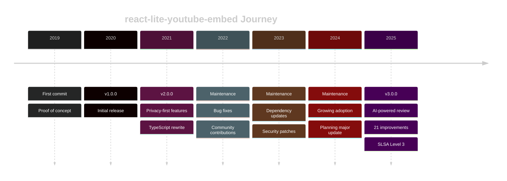

<Lead>

I've maintained [**react-lite-youtube-embed**](https://github.com/ibrahimcesar/react-lite-youtube-embed) for over three years, watching it grow to thousands of weekly downloads. But like many open source maintainers, I carried a quiet anxiety: What issues am I missing? For version 3.0.0, I decided to try something different —I  invited Claude Code to perform a comprehensive code review. What happened next surprised me: 21 improvement opportunities emerged, spanning critical bugs in React hooks, performance optimizations, accessibility enhancements, and even supply chain security with SLSA Level 3 provenance. Over 7 pull requests and zero breaking changes, my component was transformed. But not without frustations, new kinds of cognitive overload and more observations. This is the honest story of using AI as a co-maintainer, what worked, what I learned, and how it changed my approach to open source development.

</Lead>

## Background: The Component

[**React Lite YouTube Embed**](https://ibrahimcesar.github.io/react-lite-youtube-embed/) was born from a simple need: embedding YouTube videos without the performance penalty. Inspired by Paul Irish's Lite YouTube Embed, I created a React version that has since been downloaded thousands of times weekly.



<!-- TODO: Add specific download numbers, GitHub stars, real usage examples -->
<!-- SUGGESTION: Use StyledList type="card" to showcase key metrics/achievements -->

Over three years of maintenance, I've learned that open source is as much about what you see as what you don't. Every dependency update, every issue closed, every feature added—they all come with a quiet question: *What am I missing?*

Version 3.0.0 felt like the right time to answer that question systematically.

<InfoBox type="note" title="Why Version 3.0.0?">
After years of incremental updates, I wanted to step back and conduct a comprehensive audit. Not just for bugs, but for everything: performance, accessibility, security, developer experience. This wasn't about breaking changes—it was about breaking through my own blind spots as a maintainer.
</InfoBox>

## The Review Process

I approached Claude Code not as a replacement for human judgment, but as a co-maintainer with fresh eyes—someone who could systematically review every line without the fatigue or bias I'd accumulated over three years.

<!-- TODO: Describe the specific prompts and methodology used -->
<!-- TODO: Detail the conversation flow and iterative process -->

The scope was comprehensive:
- Component architecture and React patterns
- Performance and bundle size
- Accessibility compliance
- Security posture and supply chain
- Developer experience and API design
- Testing coverage and edge cases

<!-- SUGGESTION: Use StyledList type="number" size="lg" for the review areas -->

<InfoBox title="The Process" type="tip">
<!-- TODO: Add specific details about how you set up the review, what tools/commands you used, how long it took -->
</InfoBox>

## The Findings: 21 Improvements

What emerged was both humbling and enlightening—21 distinct improvement opportunities, each with its own story.

### Critical Bugs

The most alarming discoveries were in areas I thought I knew well.

<!-- TODO: Detail the React hooks issues -->
<!-- TODO: Show specific code examples of bugs found -->
<!-- TODO: Explain potential real-world impact -->

```typescript
// TODO: Add before/after code examples
```

<Alert type="warning" title="Hook Dependencies">
<!-- TODO: Describe the critical hook dependency issue that could cause stale closures -->
</Alert>

### Performance Optimizations

Performance is the whole point of this component. Finding optimization opportunities was both embarrassing and exciting.

<!-- TODO: List specific optimizations -->
<!-- TODO: Include bundle size comparisons -->
<!-- TODO: Add lighthouse score improvements -->

<StyledList type="check">
<!-- TODO: Add specific performance wins as list items -->
</StyledList>

<DiveDeep title="Technical Deep Dive: Bundle Size Reduction">
<!-- TODO: Explain the specific techniques used to reduce bundle size -->
<!-- TODO: Show webpack/rollup analysis comparisons -->
</DiveDeep>

### Accessibility Enhancements

Accessibility is non-negotiable, yet gaps remained.

<!-- TODO: Detail the a11y issues discovered -->
<!-- TODO: Explain ARIA improvements -->
<!-- TODO: Discuss keyboard navigation enhancements -->

<InfoBox type="info" title="WCAG Compliance">
<!-- TODO: Note which WCAG criteria were initially failing and how they were addressed -->
</InfoBox>

<!-- SUGGESTION: Use StyledList type="arrow" for the specific a11y fixes -->

### Security: SLSA Level 3

Perhaps the most surprising recommendation was implementing SLSA Level 3 provenance—a supply chain security standard I hadn't even considered.

<!-- TODO: Explain what SLSA is in accessible terms -->
<!-- TODO: Detail the implementation process -->
<!-- TODO: Discuss the benefits for downstream users -->

<DiveDeep title="Understanding SLSA Provenance">
SLSA (Supply-chain Levels for Software Artifacts) is a security framework developed by Google and the OpenSSF.

<!-- TODO: Expand on SLSA levels, what Level 3 means, and why it matters -->
<!-- TODO: Include links to SLSA documentation -->
</DiveDeep>

<PullQuote cite="Supply Chain Security">
Trust in open source isn't just about the code—it's about knowing where it came from and that it hasn't been tampered with.
</PullQuote>

<!-- SUGGESTION: Use StyledList type="number" to outline the SLSA implementation steps -->

## The Implementation Journey

21 improvements translated into 7 carefully crafted pull requests, each maintaining backward compatibility.

<!-- TODO: List and link to all 7 PRs -->
<!-- TODO: Describe the testing strategy for each -->
<!-- TODO: Explain how you maintained zero breaking changes -->

<StyledList type="number" size="lg">
<li><strong>PR #1:</strong> <!-- TODO: Title and brief description --></li>
<li><strong>PR #2:</strong> <!-- TODO: Title and brief description --></li>
<li><strong>PR #3:</strong> <!-- TODO: Title and brief description --></li>
<li><strong>PR #4:</strong> <!-- TODO: Title and brief description --></li>
<li><strong>PR #5:</strong> <!-- TODO: Title and brief description --></li>
<li><strong>PR #6:</strong> <!-- TODO: Title and brief description --></li>
<li><strong>PR #7:</strong> <!-- TODO: Title and brief description --></li>
</StyledList>

### The Testing Challenge

<!-- TODO: Describe your testing approach -->
<!-- TODO: Discuss challenges in testing the changes -->
<!-- TODO: Include any automated testing improvements made -->

## The Frustrations

Not everything was smooth sailing. Using AI as a co-maintainer introduced new challenges.

<!-- TODO: Describe specific frustrations encountered -->
<!-- TODO: Discuss the cognitive overhead of evaluating AI suggestions -->
<!-- TODO: Mention false positives or irrelevant suggestions -->

<Alert type="warning" title="Reality Check">
<!-- TODO: Add honest assessment of what didn't work well -->
</Alert>

### Cognitive Overload

<!-- TODO: Explain the mental burden of reviewing extensive AI-generated suggestions -->
<!-- TODO: Discuss decision fatigue -->
<!-- TODO: Compare to traditional code review burden -->

<PullQuote align="right">
AI doesn't reduce cognitive load—it transforms it. You trade implementation thinking for evaluation thinking.
</PullQuote>

### When AI Gets It Wrong

<!-- TODO: Share examples of suggestions that were incorrect or misguided -->
<!-- TODO: Explain how you identified bad suggestions -->
<!-- TODO: Discuss the importance of domain expertise -->

## Lessons Learned

This experiment changed how I think about AI-assisted development.

### What Worked Exceptionally Well

<!-- TODO: List the areas where Claude Code excelled -->
<!-- TODO: Explain what made these areas successful -->

<StyledList type="check" size="lg">
<!-- TODO: Add specific wins as list items -->
</StyledList>

### Surprising Discoveries

<!-- TODO: Share unexpected insights -->
<!-- TODO: Discuss findings that challenged your assumptions -->

<InfoBox type="tip" title="The Pattern Recognition Advantage">
<!-- TODO: Explain how AI's pattern recognition found issues you'd become blind to -->
</InfoBox>

### When to Use AI vs. When Not To

<!-- TODO: Provide guidance on appropriate use cases -->
<!-- TODO: Discuss limitations and where human judgment is essential -->

<StyledList type="highlight">
<li><strong>AI Excels:</strong> <!-- TODO: List scenarios --></li>
<li><strong>Humans Excel:</strong> <!-- TODO: List scenarios --></li>
<li><strong>Best Together:</strong> <!-- TODO: List scenarios --></li>
</StyledList>

## Impact & Metrics

Numbers tell part of the story, but not all of it.

<!-- TODO: Provide before/after metrics -->
<!-- TODO: Include user feedback or GitHub reactions -->
<!-- TODO: Share performance benchmarks -->
<!-- TODO: Discuss your confidence level as maintainer now -->

<!-- SUGGESTION: Consider creating a custom Stats component to display metrics prominently -->

### Before & After

<!-- TODO: Create comparison table or visual -->
<!-- TODO: Bundle size comparison -->
<!-- TODO: Lighthouse scores -->
<!-- TODO: Test coverage -->

### Community Response

<!-- TODO: Quote user feedback -->
<!-- TODO: Mention download trends post-3.0.0 -->
<!-- TODO: Discuss any issues or questions that arose -->

## Implications for Open Source

This experiment isn't just about one component—it's about the future of open source maintenance.

<!-- TODO: Discuss scalability of AI-assisted maintenance -->
<!-- TODO: Analyze cost vs. time investment -->
<!-- TODO: Consider accessibility for different maintainers -->
<!-- TODO: Explore ethical implications -->

<PullQuote cite="The Maintainer's Dilemma">
Open source maintainers are expected to deliver enterprise-quality software with volunteer-level resources. AI might help bridge that gap—but at what cost?
</PullQuote>

### The Economics

<!-- TODO: Break down time savings -->
<!-- TODO: Discuss AI service costs vs. human time -->
<!-- TODO: Consider opportunity costs -->

<DiveDeep title="Cost-Benefit Analysis">
<!-- TODO: Provide detailed analysis of time and money invested vs. value gained -->
</DiveDeep>

### Democratizing Best Practices

<!-- TODO: Discuss how AI could help smaller projects access expert-level reviews -->
<!-- TODO: Consider equity implications -->
<!-- TODO: Address potential downsides -->

### The Future of Maintenance

<!-- TODO: Speculate on where this is heading -->
<!-- TODO: Discuss potential industry changes -->
<!-- TODO: Consider the evolving role of maintainers -->

## Conclusion

Version 3.0.0 represents more than a milestone—it's a proof of concept for a new way of maintaining open source software.

<!-- TODO: Summarize key takeaways -->
<!-- TODO: Provide recommendations for other maintainers -->
<!-- TODO: Reflect on the changing role of developers -->
<!-- TODO: Outline next steps for react-lite-youtube-embed -->

<InfoBox title="Key Takeaways" type="note">
<StyledList type="check">
<!-- TODO: Add 3-5 bullet points with main learnings -->
</StyledList>
</InfoBox>

### For Other Maintainers

If you're considering AI-assisted maintenance:

<!-- SUGGESTION: Use StyledList type="number" for step-by-step recommendations -->

### What's Next

The journey doesn't end here. With 3.0.0 shipped, new questions emerge:

<!-- TODO: Outline future plans for the component -->
<!-- TODO: Discuss ongoing AI collaboration -->
<!-- TODO: Invite community feedback -->

---

## Resources & References

<!-- SUGGESTION: Use StyledList type="arrow" for resource links -->

<StyledList type="arrow">
<li><strong>Project Repository:</strong> [react-lite-youtube-embed](https://github.com/ibrahimcesar/react-lite-youtube-embed)</li>
<li><strong>SLSA Documentation:</strong> [slsa.dev](https://slsa.dev)</li>
<li><strong>Claude Code:</strong> [Claude by Anthropic](https://claude.ai)</li>
<!-- TODO: Add more relevant links -->
</StyledList>

### The Pull Requests

All changes were implemented across these PRs:

<!-- TODO: List all 7 PRs with links and descriptions -->

---

<Alert type="info">
This post represents my honest experience with AI-assisted open source maintenance. Your mileage may vary. I'd love to hear about your experiences—reach out on [GitHub](https://github.com/ibrahimcesar).
</Alert> 