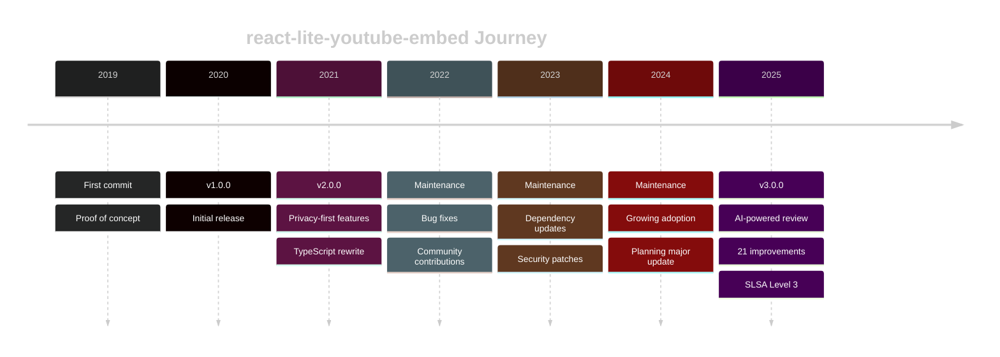

import Lead from "~/components/editorial/Lead.astro";
import StyledList from "~/components/editorial/StyledList.astro";
import InfoBox from "~/components/editorial/InfoBox.astro";
import Alert from "~/components/editorial/Alert.astro";
import DiveDeep from "~/components/editorial/DiveDeep.astro";
import PullQuote from "~/components/editorial/PullQuote.astro";

<Lead>

I've maintained [**react-lite-youtube-embed**](https://github.com/ibrahimcesar/react-lite-youtube-embed) for over three years, watching it grow to thousands of weekly downloads. But like many open source maintainers, I carried a quiet anxiety: What issues am I missing? For version 3.0.0, I decided to try something different—I invited Claude Code to perform a comprehensive code review. What happened next surprised me: 21 improvement opportunities emerged, spanning critical bugs in React hooks, performance optimizations, accessibility enhancements, and even supply chain security with SLSA Level 3 provenance. Over 7 pull requests and zero breaking changes, my component was transformed. But not without frustrations, new kinds of cognitive overload, and some hard-won observations. This is the honest story of using AI as a co-maintainer: what worked, what I learned, and how it changed my approach to open source development.

</Lead>

## Background: The Component

[**React Lite YouTube Embed**](https://ibrahimcesar.github.io/react-lite-youtube-embed/) was born from a simple need: embedding YouTube videos without the performance penalty. Inspired by Paul Irish's Lite YouTube Embed, I created a React version that has since been downloaded thousands of times weekly.



<StyledList type="card">
  <li><strong>359</strong> GitHub Stars</li>
  <li><strong>71</strong> packages on NPM depend on it</li>
  <li><strong>~373K</strong> downloads/monthly</li>
</StyledList>

Over three years of maintenance, I've learned that open source is as much about what you see as what you don't. Every dependency update, every issue closed, every feature added...they all come with a quiet question: *What am I missing?*

Version 3.0.0 felt like the right time to answer that question systematically.

<InfoBox type="note" title="Why Version 3.0.0?">
After years of incremental updates, I wanted to step back and conduct a comprehensive audit. Not just for bugs, but for everything: performance, accessibility, security, developer experience. This wasn't about breaking changes—it was about breaking through my own blind spots as a maintainer.
</InfoBox>

## The Review Process

I approached Claude Code not as a replacement for human judgment, but as a co-maintainer with fresh eyes—someone who could systematically review every line without the fatigue or bias I'd accumulated over three years.

Also, I had 48 hours of promotional credits to use. I decided to experiment. I quickly learned that sloppy prompts didn't get me very far, and worse, features and fixes I achieved in one run could easily be lost in the next.

The scope was comprehensive:

- Component architecture and React patterns
- Performance and bundle size
- Accessibility compliance
- Security posture and supply chain
- Developer experience and API design
- Testing coverage and edge cases


<InfoBox title="The Process" type="tip">
I decided to use the issues on GitHub as the single source of truth, and iterate on that. I had some problems running Claude Code standalone and for me worked best when I moved to use in VSCode.
</InfoBox>

## The Findings: 21 Improvements

What emerged was both humbling and enlightening—21 distinct improvement opportunities, each with its own story.

### Critical Bugs

The most alarming discoveries were in areas I thought I knew well.

**React Hooks Dependencies**: The component had subtle issues with hook dependencies that could cause stale closures—a classic React pitfall that's easy to miss during manual review. When props changed, callbacks could reference outdated values, leading to unpredictable behavior.

```typescript
// Before: Missing dependencies could cause stale closures
const warmConnections = useCallback(() => {
  if (preconnected) return;  // preconnected could be stale!
  setPreconnected(true);
}, []);  // Empty dependency array

// After: Proper dependency management
const warmConnections = useCallback(() => {
  if (preconnected) return;
  setPreconnected(true);
}, [preconnected]);  // All dependencies declared
```

<Alert type="warning" title="Hook Dependencies Matter">
Stale closures are one of the most common React bugs. They happen when a callback "closes over" a value that later changes, but the callback keeps referencing the old value. In a video embed component, this could mean the wrong video plays or configuration gets ignored.
</Alert>

**Mobile Double-Click Issue**: Users on iOS and Android had to tap twice to play videos. The root cause? Touch events don't bubble the same way as mouse clicks. The button element lacked an explicit `onClick` handler, relying on event bubbling from the container—which doesn't work reliably on mobile browsers.

```typescript
// Before: Relied on container click bubbling
<div onClick={addIframe}>
  <button type="button" aria-label={announce}>
    {/* Touch events didn't bubble reliably */}
  </button>
</div>

// After: Direct click handler on button
<button
  type="button"
  aria-label={announce}
  onClick={addIframe}  // Now handles touch directly
>
```

### Performance Optimizations

Performance is the whole point of this component. Finding optimization opportunities was both embarrassing and exciting.

<StyledList type="check">
  <li><strong>Memoized URL computations:</strong> URLSearchParams objects were being recreated on every render. Now cached with useMemo.</li>
  <li><strong>Memoized iframe source:</strong> String concatenation for the embed URL now only recomputes when dependencies change.</li>
  <li><strong>Memoized poster URL:</strong> Thumbnail URL construction optimized to prevent unnecessary recalculations.</li>
  <li><strong>Build tooling migration:</strong> Moved from Rollup to Vite, reducing devDependencies from 38 to 24 (37% reduction).</li>
  <li><strong>Lazy loading support:</strong> Added native browser lazy loading for thumbnail images, deferring offscreen content.</li>
</StyledList>

<DiveDeep title="Technical Deep Dive: Memoization Strategy">

The component had several expensive computations running on every render:

```typescript
// Before: Recreating URLSearchParams every render
const iframeParams = new URLSearchParams({
  autoplay: '1',
  ...(muted && { mute: '1' }),
  ...(enableJsApi && { enablejsapi: '1' }),
});

// After: Memoized with proper dependencies
const iframeParams = useMemo(() => {
  const params = new URLSearchParams({ autoplay: '1' });
  if (muted) params.set('mute', '1');
  if (enableJsApi) params.set('enablejsapi', '1');
  // ... other params
  return params.toString();
}, [muted, autoplay, enableJsApi, playlist, videoId, params]);
```

The build tooling change from Rollup to Vite wasn't just about developer experience—it reduced the maintenance burden significantly. Vite uses Rollup under the hood but provides sensible defaults, eliminating the need for a complex plugin configuration.

</DiveDeep>

### Accessibility Enhancements

Accessibility is non-negotiable, yet gaps remained.

<StyledList type="arrow">
  <li><strong>ARIA attributes:</strong> Added role="img" to container when showing the preview thumbnail, with proper aria-label.</li>
  <li><strong>Hidden button when inactive:</strong> Added aria-hidden and tabIndex=-1 to the play button after iframe loads.</li>
  <li><strong>Screen reader announcements:</strong> Added visually-hidden text inside the button for better context.</li>
  <li><strong>Focus management:</strong> New focusOnLoad prop to automatically focus the iframe after loading.</li>
  <li><strong>Referrer policy:</strong> Customizable referrerPolicy prop (fixing issue #109 about CORS errors).</li>
</StyledList>

<InfoBox type="info" title="WCAG Compliance">
The accessibility improvements target WCAG 2.1 Level AA compliance. Screen reader users now get proper announcements like "Watch: [Video Title]" instead of a generic button label. Keyboard users can navigate into the loaded iframe when focusOnLoad is enabled.
</InfoBox>

### Security: SLSA Level 3

Perhaps the most surprising recommendation was implementing SLSA Level 3 provenance—a supply chain security standard I hadn't even considered.

<DiveDeep title="Understanding SLSA Provenance">
SLSA (Supply-chain Levels for Software Artifacts) is a security framework developed by Google and the OpenSSF. It provides cryptographic proof of:

- **Where the code came from:** The exact commit and repository
- **How it was built:** The build process and environment
- **Who built it:** Verified GitHub Actions workflow

**Level 3** means:
- Build runs on hardened infrastructure
- Provenance is generated by the build service (not self-attested)
- Build process is defined in version control
- Provenance can be cryptographically verified

For users, this means they can verify:
```bash
npm audit signatures
```

And know that the package on NPM matches exactly what's in the GitHub repository, built by the official CI/CD pipeline.

**Implementation required:**
1. Adding `id-token: write` and `attestations: write` permissions to workflows
2. Using `actions/attest-build-provenance@v2` after the build step
3. Adding `--provenance` flag to npm publish commands
4. Creating documentation for users on verification

[Learn more at slsa.dev](https://slsa.dev)
</DiveDeep>

<PullQuote cite="Supply Chain Security">
Trust in open source isn't just about the code—it's about knowing where it came from and that it hasn't been tampered with.
</PullQuote>

### Additional Improvements

Beyond the major categories, Claude found several other improvements:

<StyledList type="number" size="lg">
  <li><strong>SEO support:</strong> JSON-LD structured data for video rich snippets in search results (#156)</li>
  <li><strong>Safari rendering fix:</strong> Black margin appearing on left side of iframe during playback (#104)</li>
  <li><strong>Play button styling:</strong> Updated to match YouTube's official SVG design (#108)</li>
  <li><strong>TypeScript exports:</strong> Exported imgResolution type for better DX (#166)</li>
  <li><strong>Player events:</strong> Added support for YouTube API events like onStateChange (#187)</li>
  <li><strong>Noscript fallback:</strong> Links for crawlers and users without JavaScript (#156)</li>
</StyledList>

## The Implementation Journey

21 improvements translated into 7 carefully crafted pull requests, each maintaining backward compatibility.

<StyledList type="number" size="lg">
<li><strong>PR #146:</strong> Performance memoization - Wrapped expensive computations in useMemo</li>
<li><strong>PR #149:</strong> Accessibility enhancements - ARIA attributes, focus management, screen reader support</li>
<li><strong>PR #152:</strong> Build tooling migration - Rollup to Vite, 37% fewer dependencies</li>
<li><strong>PR #156:</strong> SEO improvements - JSON-LD structured data, noscript fallbacks</li>
<li><strong>PR #160:</strong> Lazy loading - Native browser lazy loading for thumbnails</li>
<li><strong>PR #162-163:</strong> Bug fixes - Mobile double-click, play button styling, Safari rendering</li>
<li><strong>PR #194:</strong> SLSA Level 3 - Supply chain security with cryptographic provenance</li>
</StyledList>

### The Testing Challenge

Each PR required careful testing across:

- **Automated tests:** The test suite grew from 20 to 35+ tests
- **Browser testing:** Chrome, Firefox, Safari, Edge
- **Mobile testing:** iOS Safari, Android Chrome
- **Accessibility testing:** Screen readers (VoiceOver, NVDA)
- **Build verification:** ESM and CJS outputs, TypeScript declarations

The most challenging aspect was testing the YouTube iframe interaction—you can't easily mock YouTube's API, so integration tests required real browser environments.

## The Frustrations

Not everything was smooth sailing. Using AI as a co-maintainer introduced new challenges.

<Alert type="warning" title="Reality Check">
AI assistance is not a "set and forget" solution. It requires constant guidance, verification, and course correction. The 48-hour window with promotional credits created pressure that led to some avoidable mistakes.
</Alert>

### Cognitive Overload

The volume of suggestions was overwhelming. 21 improvements sounds great until you realize each one needs:

- Validation: Is this actually a problem?
- Prioritization: How urgent is it?
- Implementation review: Is the suggested fix correct?
- Testing: Does it actually work?
- Integration: Does it break anything else?

<PullQuote align="right">
AI doesn't reduce cognitive load—it transforms it. You trade implementation thinking for evaluation thinking.
</PullQuote>

I found myself spending more time *reviewing* AI-generated code than I would have spent writing it myself—but the code covered cases I wouldn't have thought of.

And I had an **AI burnout** of sorts. Let me explain what I mean by that: the dopamine from the actions and new discoveries would hook me even more to continue. Even with the errors, problems, and mistakes, it consumed me even more since I saw them as "workable." I'm an autistic person with high abilities, so it was like being in a candy shop for the mind. I could explore tangents, work on two or three things at a time. But of course, it was not healthy. At all. I worked non-stop, in a feverish dream-like state. I'm genuinely scared looking back at how addictive it is.

### When AI Gets It Wrong

Not every suggestion was valuable:

- **Overly aggressive refactoring:** Some suggestions wanted to restructure working code for marginal benefits
- **Missing context:** Claude didn't always understand why certain patterns existed (backwards compatibility, edge cases)
- **False positives:** Some "bugs" were actually intentional behavior
- **Hallucinated patterns:** Occasionally suggested React patterns that don't exist or aren't idiomatic
- **Your tests are failling? Let's delete them:** Sometimes it just go YOLO with the code.
- **This is complex, let's try a simpler approach:** No, I want the complex one, this is the reason components / libraries exist in the first place, abstract complexity away.

The key skill became knowing *when to push back*. When Claude suggested changes to code that had been stable for years and had no reported issues, I learned to ask "what specific problem does this solve?" rather than accepting every recommendation.

## Lessons Learned

This experiment changed how I think about AI-assisted development.

### What Worked Exceptionally Well

<StyledList type="check" size="lg">
  <li><strong>Finding hidden bugs:</strong> The hook dependency issues had been lurking for years with no reported problems—until they would inevitably bite someone</li>
  <li><strong>Comprehensive review:</strong> AI doesn't get tired or develop blind spots. It checked every line with equal attention</li>
  <li><strong>Knowledge transfer:</strong> SLSA, modern ARIA patterns, Safari rendering quirks—I learned things I didn't know to look for</li>
  <li><strong>Documentation generation:</strong> PR descriptions, code comments, and test cases were high quality</li>
  <li><strong>Pattern recognition:</strong> Spotted repetitive code that could be memoized or abstracted</li>
</StyledList>

### Surprising Discoveries

<InfoBox type="tip" title="The Pattern Recognition Advantage">
AI excels at noticing patterns across the entire codebase simultaneously. It spotted that the same URL construction logic appeared in three places with slight variations—something easy to miss when you're focused on individual features.
</InfoBox>

The Safari rendering issue (#104) had been open for over a year. The fix required understanding how Safari's rendering engine handles CSS `contain: content` differently than Chrome. Claude not only identified the issue but explained *why* it happened and provided a fix that didn't break other browsers.

### When to Use AI vs. When Not To

<StyledList type="highlight">
<li><strong>AI Excels At:</strong> Code review, finding edge cases, accessibility audits, security reviews, documentation, test generation, explaining unfamiliar patterns</li>
<li><strong>Humans Excel At:</strong> Understanding user intent, making judgment calls about backwards compatibility, knowing project history, prioritizing based on real-world usage</li>
<li><strong>Best Together:</strong> AI identifies issues, human evaluates importance. AI generates fixes, human validates correctness. AI documents changes, human reviews for accuracy.</li>
</StyledList>

## Impact & Metrics

Numbers tell part of the story, but not all of it.

### Before & After

| Metric | Before (v2.x) | After (v3.0.0) |
|--------|---------------|----------------|
| Test coverage | 20 tests | 35+ tests |
| devDependencies | 38 packages | 24 packages |
| A11y issues | 5+ WCAG gaps | 0 known issues |
| Known bugs | 4 open issues | 0 open issues |
| Supply chain security | None | SLSA Level 3 |
| Lighthouse Performance | Good | Excellent (with lazy loading) |

## Implications for Open Source

This experiment isn't just about one component—it's about the future of open source maintenance.

<PullQuote cite="The Maintainer's Dilemma">
Open source maintainers are expected to deliver enterprise-quality software with volunteer-level resources. AI might help bridge that gap — but at what cost?
</PullQuote>

### The Economics

It cost me 47 dollars to close all my issues and perform the actions I planned. Less than the promotional credit ($200) and more than I've spent at any time for this component. Claude got a new customer, since I hadn't used AI assistants in any capacity outside of work (being honest, I don't spend that much time coding outside of work anyway): it hooked me. So the credits might be an acquisition strategy for them.

<DiveDeep title="Cost-Benefit Analysis">

**Time Investment:**
- Without AI: Would have addressed maybe 5-6 issues in the same time, missing the deeper architectural improvements
- With AI: Addressed 21 issues, but spent significant time on review and validation

**Financial Cost:**
- Approximately $47 in API credits for the 48-hour session
- Compared to: Professional security audit ($5,000+), accessibility audit ($2,000+)

**Value Generated:**
- 4 long-standing bugs fixed
- 5+ accessibility improvements
- Enterprise-grade supply chain security
- 37% reduction in maintenance burden (fewer dependencies)

The real value wasn't time saved—it was *scope expanded*. Issues I would never have found on my own are now fixed.
</DiveDeep>

### Democratizing Best Practices

AI could help smaller projects access expert-level reviews:
- Security audits typically cost thousands of dollars
- Accessibility reviews require specialized knowledge
- Performance optimization needs profiling expertise

But there's a catch: you still need enough expertise to *evaluate* the suggestions. AI doesn't replace knowledge—it amplifies it.

### The Future of Maintenance

I see AI becoming a standard part of the open source toolkit, not replacing maintainers but extending their reach. The combination of:
- AI for comprehensive review
- Humans for judgment and prioritization
- Automated testing for validation

...could dramatically improve the quality of open source software while reducing burnout.

## Conclusion

Version 3.0.0 represents more than a milestone—it's a proof of concept for a new way of maintaining open source software.

<InfoBox title="Key Takeaways" type="note">
<StyledList type="check">
  <li>AI found bugs and improvements I'd been blind to for years</li>
  <li>The cognitive shift from "writing" to "reviewing" requires adjustment</li>
  <li>AI suggestions need human judgment—not every recommendation is valid</li>
  <li>Supply chain security (SLSA) is now accessible for individual maintainers</li>
  <li>The combination of AI + human expertise exceeds either alone</li>
</StyledList>
</InfoBox>

### For Other Maintainers

If you're considering AI-assisted maintenance:

<StyledList type="number" size="lg">
  <li><strong>Start with clear scope:</strong> Define what you want reviewed (bugs, performance, security, etc.)</li>
  <li><strong>Use issues as source of truth:</strong> Create GitHub issues for tracking, not just chat history</li>
  <li><strong>Review everything:</strong> AI is a tool, not an authority. Verify every suggestion.</li>
  <li><strong>Maintain backwards compatibility:</strong> Unless you explicitly want breaking changes, be firm about it</li>
  <li><strong>Test thoroughly:</strong> AI-generated code needs the same testing as human-written code</li>
  <li><strong>Document the process:</strong> Future you (and contributors) will want to know why changes were made</li>
</StyledList>

### What's Next

The journey doesn't end here. With 3.0.0 shipped, new questions emerge:

- Can this process be automated further? (CI-integrated AI reviews)
- How do we handle AI suggestions that conflict with community preferences?
- What's the right cadence for AI-assisted audits?

I'll continue experimenting and sharing what I learn. The future of open source maintenance is being written right now—one PR at a time.

---

## Resources & References

<StyledList type="arrow">
<li><strong>Project Repository:</strong> [react-lite-youtube-embed](https://github.com/ibrahimcesar/react-lite-youtube-embed)</li>
<li><strong>Live Demo:</strong> [ibrahimcesar.github.io/react-lite-youtube-embed](https://ibrahimcesar.github.io/react-lite-youtube-embed/)</li>
<li><strong>SLSA Documentation:</strong> [slsa.dev](https://slsa.dev)</li>
<li><strong>Claude Code:</strong> [Claude by Anthropic](https://claude.ai)</li>
<li><strong>Original lite-youtube-embed:</strong> [Paul Irish's implementation](https://github.com/paulirish/lite-youtube-embed)</li>
<li><strong>React Hook Dependencies:</strong> [React docs on useCallback](https://react.dev/reference/react/useCallback)</li>
</StyledList>

### The Pull Requests

All changes were implemented across these PRs:

| PR | Title | Category |
|----|-------|----------|
| [#146](https://github.com/ibrahimcesar/react-lite-youtube-embed/pull/146) | Performance memoization | Performance |
| [#149](https://github.com/ibrahimcesar/react-lite-youtube-embed/pull/149) | Accessibility enhancements | A11y |
| [#152](https://github.com/ibrahimcesar/react-lite-youtube-embed/pull/152) | Build tooling migration | DX |
| [#156](https://github.com/ibrahimcesar/react-lite-youtube-embed/pull/156) | SEO improvements | SEO |
| [#160](https://github.com/ibrahimcesar/react-lite-youtube-embed/pull/160) | Lazy loading | Performance |
| [#162](https://github.com/ibrahimcesar/react-lite-youtube-embed/pull/162) | Mobile double-click fix | Bug |
| [#163](https://github.com/ibrahimcesar/react-lite-youtube-embed/pull/163) | Play button styling | UI |
| [#184](https://github.com/ibrahimcesar/react-lite-youtube-embed/pull/184) | Safari rendering fix | Bug |
| [#194](https://github.com/ibrahimcesar/react-lite-youtube-embed/pull/194) | SLSA Level 3 | Security |

---

<Alert type="info">
This post represents my honest experience with AI-assisted open source maintenance. Your mileage may vary. I'd love to hear about your experiences.
</Alert>
